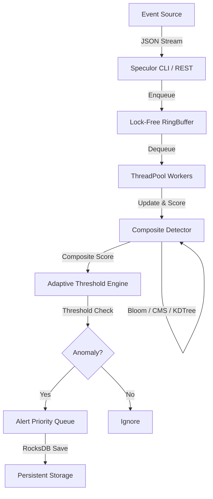

# Speculor

**Speculor** is a high-performance C++ streaming anomaly detection engine designed for real-time event analytics. It features a multi-algorithm composite detection pipeline integrated with a dynamic, adaptive threshold alerting system.

---

## Key Features

- **Composite Detector Pipeline**: Aggregates scores from multiple detection algorithms:
  - **Counting Bloom Filter**: Estimates pattern rarity using space-efficient hashing.
  - **Count-Min Sketch**: Estimates statistical frequency of events.
  - **Multi-Dimensional KD-Tree**: Computes spatial nearest-neighbor distances for anomaly scoring.
- **Adaptive Threshold Engine**: Learns thresholds dynamically using:
  - **Exponential Moving Average (EMA)**: Follows the variance of anomaly scores.
  - **Threshold Optimizer**: Performs dynamic programming on a sliding window to maximize F1-score.
- **Concurrency Infrastructure**:
  - **SPMC Ring Buffer**: Lock-free single-producer multi-consumer queue for high-throughput ingestion.
  - **ThreadPool**: Work-stealing queue for background processing of event batches.
  - **Task Scheduler**: Deferable periodic execution engine for maintenance tasks (e.g., snapshots, decay cycles).
- **Persistence Layer**: Built-in state snapshots and recovery using **RocksDB**.
- **Cross-Platform Plugin System**: Platform-agnostic plugin loader supporting Windows DLLs (`LoadLibraryA`) and Linux shared libraries (`dlopen`).
- **REST Server & CLI**: Out-of-the-box binaries for pipeline orchestration.

---

## Architecture Flow



---

## Directory Structure

```text
speculor/
├── CMakeLists.txt             # CMake Build Configuration
├── vcpkg.json                 # Dependency Management
├── config.yaml                # Sample Configuration
├── events.jsonl               # Test Event Stream
├── include/speculor/          # Public Headers
│   ├── core/                  # Engine, Event, Alert definitions
│   ├── detectors/             # Bloom, CMS, KD-Tree, Composite
│   ├── concurrency/           # RingBuffer, ThreadPool, Scheduler
│   ├── storage/               # RocksDB integration, Compressor, Serializer
│   └── plugin/                # Plugin Base & Loader
└── src/                       # Implementation files
```

---

## Build Instructions

### Prerequisites
Ensure you have the following installed:
- **CMake** (v3.20+)
- **Ninja** or another compatible build tool
- A C++17 compatible compiler (e.g., GCC 9+, MSVC 2019+, Clang 10+)
- **vcpkg** package manager

### Step 1: Bootstrap Dependencies via vcpkg
If you do not have a global `vcpkg` installation, clone and bootstrap a local instance:
```powershell
git clone https://github.com/microsoft/vcpkg.git C:\vcpkg
C:\vcpkg\bootstrap-vcpkg.bat
```

### Step 2: Configure and Build
Configure CMake by pointing to the `vcpkg.cmake` toolchain file:
```powershell
cmake -B build -S . -DCMAKE_TOOLCHAIN_FILE="C:/vcpkg/scripts/buildsystems/vcpkg.cmake"
cmake --build build --config Release
```

---

## Getting Started

### 1. Run via CLI
Stream events from a JSONL file through the CLI and view real-time alerts:
```powershell
./build/speculor -c config.yaml -i events.jsonl
```

Or stream events directly from standard input:
```powershell
echo '{"metric_name": "cpu_usage", "value": 95.8}' | ./build/speculor -c config.yaml
```

### 2. Run REST Server
Start the HTTP REST API server (listening on port `8080` by default):
```powershell
./build/speculor_rest 8080
```

#### Push an Event
```bash
curl -X POST http://localhost:8080/event \
  -H "Content-Type: application/json" \
  -d '{"metric_name": "network_tx", "value": 850000.0, "labels": {"env": "prod"}}'
```

#### Retrieve Recent Alerts
```bash
curl http://localhost:8080/alerts
```

---

## 🐳 Docker Deployment

### Running with Docker Compose
You can run the Speculor anomaly detection REST server in a containerized environment (built using a multi-stage Dockerfile with vcpkg and Ninja):

1. **Build and start the container**:
   ```bash
   docker compose up -d --build
   ```
2. **Access the REST server**:
   The server listens on port `8080`. Push events and query alerts as described in the Getting Started section above.

Persistent state snapshots are saved in the RocksDB database, which is mounted and persisted on the host machine using a named volume (`speculor-data`).

